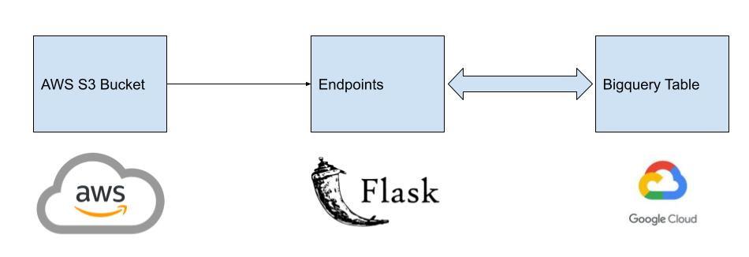

# Globant Coding Test

 This repo contains code for interview based on Globant's Data Engineering Coding Challenge. This file can be reviewed in this link.

## Table of Contents

- [Data Source](#data_source)
- [Data pipeline design](#data_pipeline_design)

## Data Source 

Data source for this exercise are csv files found in <strong>files</strong> folder:
<li>departments.csv</li>
<li>hired_employees.csv</li>
<li>jobs</li>

## Data Pipeline Design 

Files mentioned above are in one AWS S3 Bucket. Transformation occurs with flask's endpoints to export these files to Google Bigquery which is data sink for this exercise.

